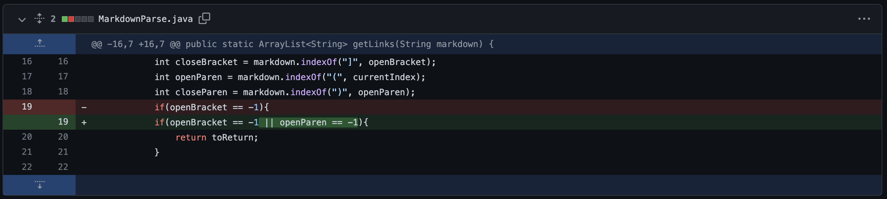
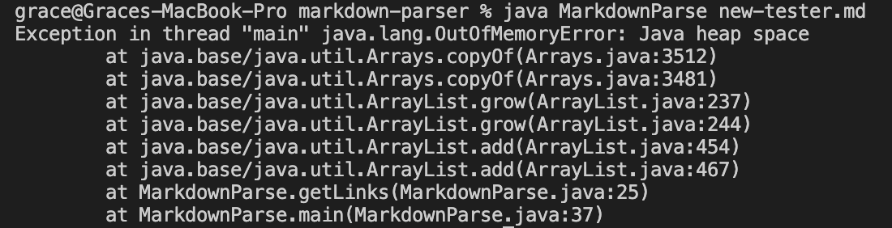

# Lab Report 2

## Change 1

[test file](https://github.com/yyygrace/markdown-parser/blob/main/test-file2.md)

The bug for this is an infinite while loop. The symptom is the error message that prints after a long time. This is because in the test file, the last character is not a `)`, to indicate the end of a link.

 

___

 

## Change 2

[test file]((https://github.com/yyygrace/markdown-parser/blob/main/image-tester.md))

The bug and symptom for this is the same, which is that the link or path to the image is returned. This is because the markdown format of an image is very similar to that of a link.

 

___

 

## Change 3

[test file](https://github.com/yyygrace/markdown-parser/blob/main/new-tester.md)

The bug and symptom for this is that the program outputs a blank space for when there is a set of parentheses that contains nothing. This is because the program will add another element to the list no matter what is contained in a set of parentheses.

 

---

 

