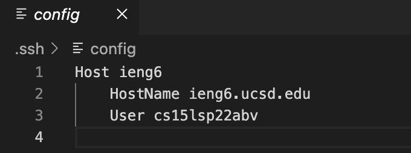
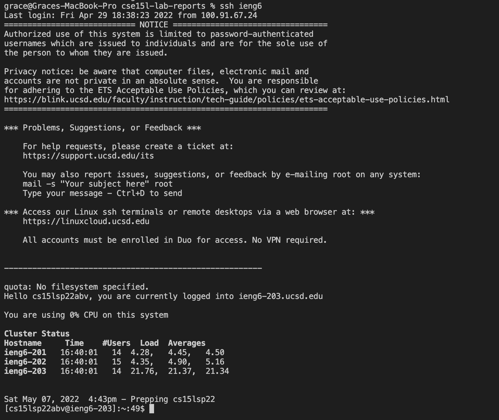
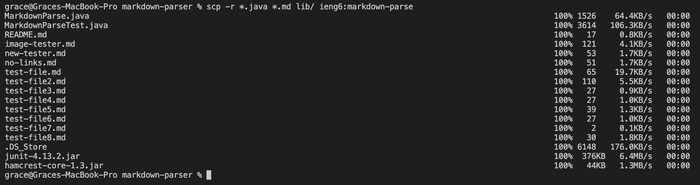
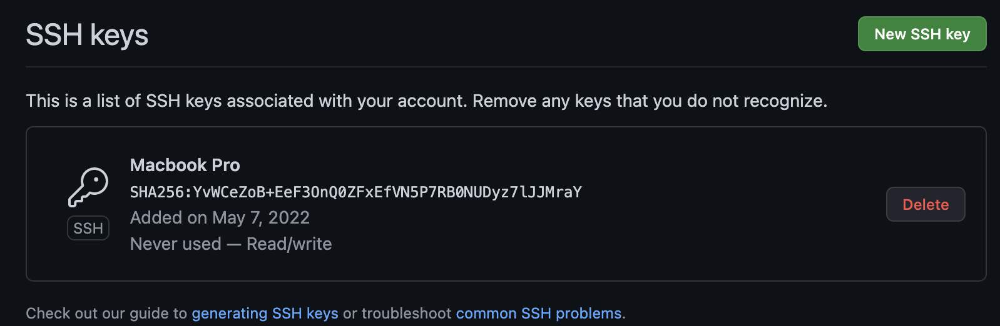
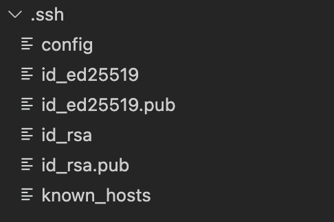
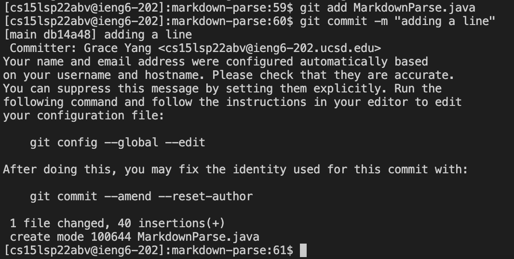
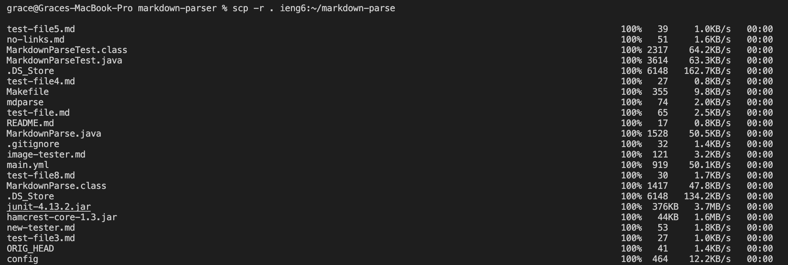
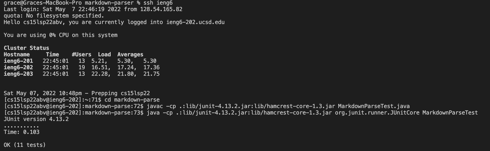
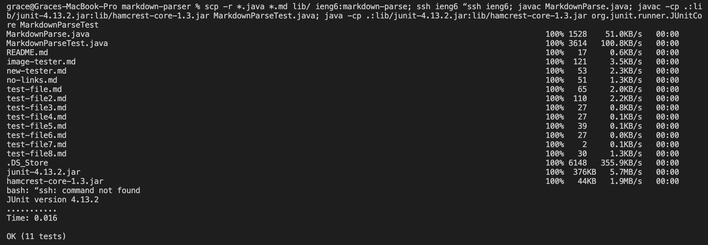

# Lab Report 3

## Streamlining ssh Configuration

First, I created a file called config in the `.ssh` directory. Then, I added the lines
```
Host ieng6
    HostName ieng6.ucsd.edu
    User cs15lsp22abv
```
to the file.



Now that the file is set up, I can log into the remote desktop with the command `ssh ieng6`.



To copy a file from local machine to the remote server, I only needed to type `scp -r *.java *.md lib/ ieng6:markdown-parse` instead of `scp -r *.java *.md lib/ cs15lsp22abv@ieng6.ucsd.edu:markdown-parse` which has my full username.



---

## Setup Github Access from ieng6

Following the steps [here](https://docs.github.com/en/authentication/connecting-to-github-with-ssh/adding-a-new-ssh-key-to-your-github-account), I created a public SSH key.



The private key is stored similarly in the `~/.ssh` directory under the file name `id_ed25519`



Then, I ran the commands `git add MarkdownParse.java` and `git commit -m "adding a line"` to commit and push a change to Github.




Here is the [link](https://github.com/yyygrace/markdown-parser/commit/2c3d61b66045f82b32744b31fef6ff9eab048c45) to the resulting commit on Github. 

---

## Copy whole directories with `scp -r`

To copy over the whole markdown-parse directory, run the command `scp -r . ieng6:~/markdown-parse`.


(this image only includes part of what is copied over)

Now that it is copied over, I can log into my ieng6 account and run the tests in the remote server.



To streamline this process even more, the commands can be combined all into one line.



----


