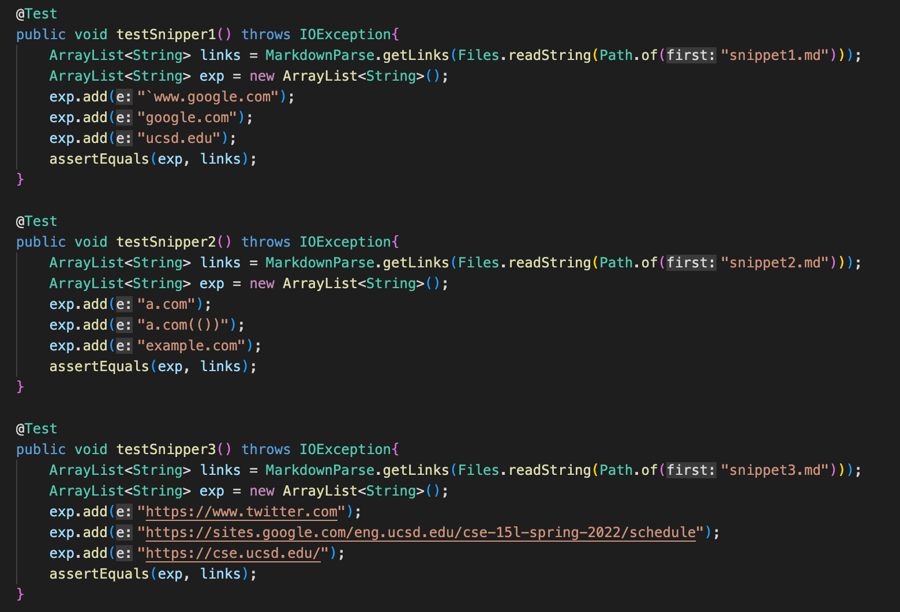
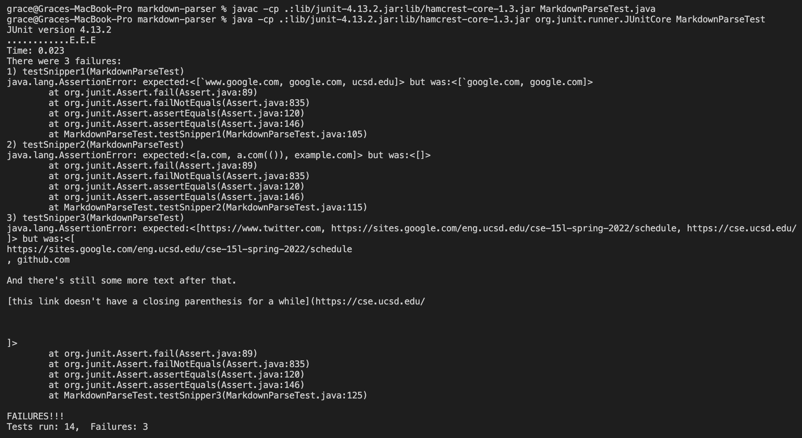
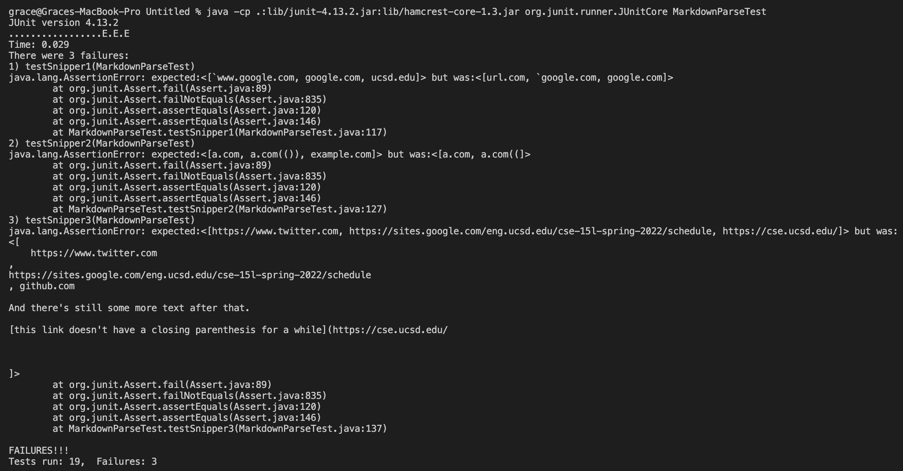

# Lab Report 4

[My Repository](https://github.com/yyygrace/markdown-parser)

[Reviewed Repository](https://github.com/Anujjain2579/markdown-parser)

## Expected output for snippet 1:

```[`www.google.com, google.com, ucsd.edu]```

## Expected output for snippet 2:

```[a.com, a.com(()), example.com]```

## Expected output for snippet 3:

```[https://www.twitter.com, https://sites.google.com/eng.ucsd.edu/cse-15l-spring-2022/schedule, https://cse.ucsd.edu/]```


## Code in `MarkdownParseTest.java`


## My output


## Reviewed output


## Question 1:

Yes. Similar to the brackets and parentheses, two more variables storing the index of the backticks need to be created. Then, the following code checking the location of parentheses and brackets would ignore values in those indexes.

## Question 2:

No. There would be a more involved change where the index of the open bracket is updated but only in certain situations. A similar concept would also need to be applied for the parentheses. 

## Question 3:

No. This change would check for cases where there are line breaks involved in the middle of a set of brackets and parenthesis. Then it would go through a different series of cases to check if the line break messes up the link or not. 

---


