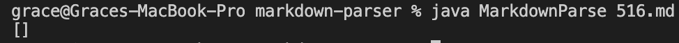
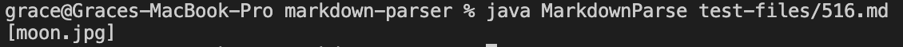

# Lab Report 5

To find the different results, I used `vimdiff` to see the differences between my output and the provided implementation.

The highlighted portions are where the two implementations differed. Mine is on the left and the provided is on the right.

---

## Test File 1

[file 472](https://github.com/nidhidhamnani/markdown-parser/blob/main/test-files/472.md)

My Output:

Provided Output:

Expected Output:

`/url`

The provided implementation produces the correct output. 

The bug is from when I modified the code to ignore images. I set it so that if the index of `openBracket` is greater than 0, then there would be the possibility for an `!` to exist, invalidating the link. However, I never added an alternative option for when `openBracket` is at the first index followed by a valid link that should be added to `toReturn`, which is what is producing the bug in this case. 

---

## Test File 2

[file 516](https://github.com/nidhidhamnani/markdown-parser/blob/main/test-files/516.md)

My Output:

Provided Output:

Expected Output:

`[]`

My implementation produces the correct output. The bug in the provided implementation is that it does not check whether or not there is an `!` before the brackets, which indicate that the following link is for an image, and should be ignored. 

Before the index of `nextOpenBracket` is set, it should check for an `!` at the index before the `[`.

---

